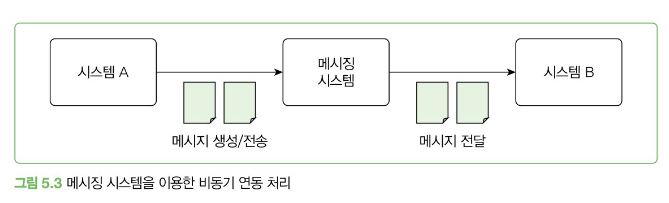
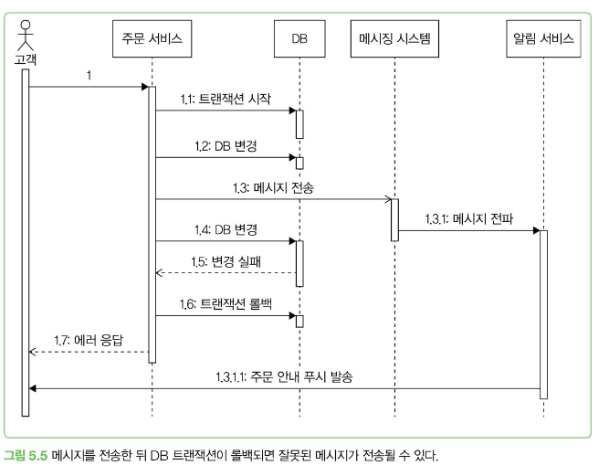
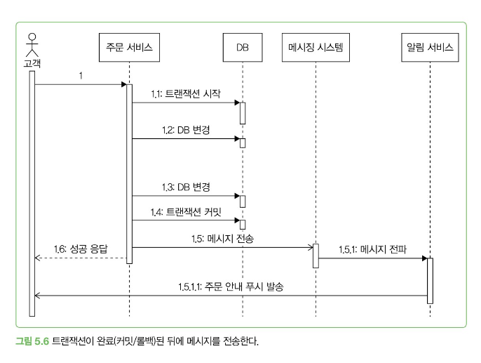
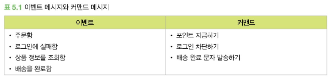
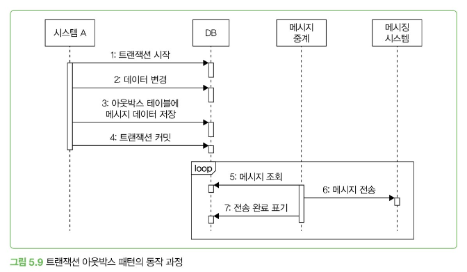
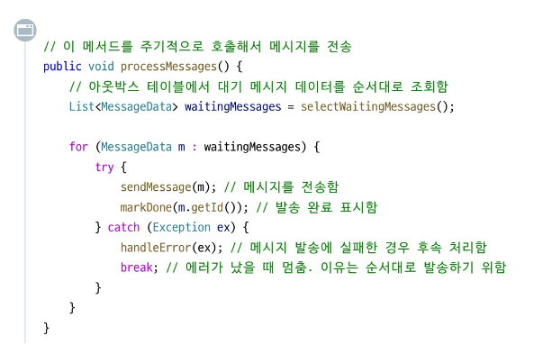
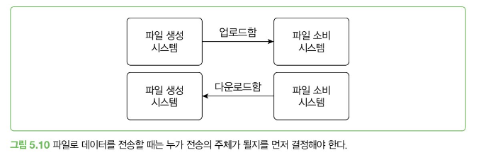
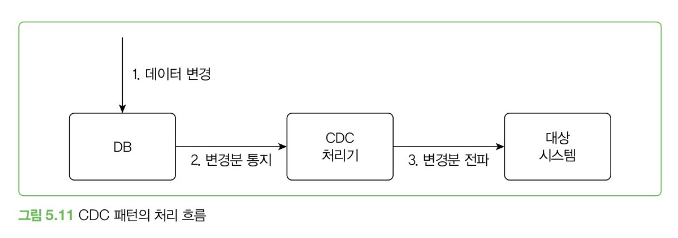
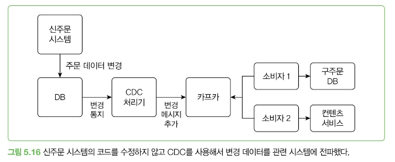

# 동기 연동과 비동기 연동

## 동기 방식

- 한 작업이 끝날 때까지 다음 작업이 진행되지 않는다.
- 코드의 순서가 실행 순서이기 때문에 프로그램의 흐름을 직관적으로 이해할 수 있다.
- 외부 연동이 엮여 있을 시 외부 연동 실패가 전체 기능의 실패인지 확인해야 한다.
    - 하지만 외부 연동이 실패해도 기능 자체는 정상적으로 동작해야 한다. ⇒ 비동기 방식을 고려해보자

## 비동기 방식

- 한 작업이 끝날 때까지 기다리지 않고 바로 다음 작업을 처리한다.
- 비동기 방식을 사용해도 문제가 되지 않는 상황
    1. 시차가 생겨도 문제가 생기지 않는다. (기존 기능에 영향을 미치지 않는다.)
    2. 일부 기능은 실패했을 때 재시도가 가능하다. 
    3. 연동에 실패했을 때 나중에 수동으로 처리할 수 있다. (EX: 검색 서비스 컨텐츠 등록)
    4. 무시해도 되는 기능 (알림 기능)
    
    ⇒ 위와 같은 상황에 해당하면 비동기로 처리할 수 있는지 검토해보자 
    
- 대표적인 비동기 방식
    1. 별도 스레드로 실행하기
    2. 메시징 시스템 
    3. 트랜잭션 아웃박스 패턴
    4. 배치로 연동하기
    5. CDC 이용하기 

## 별도 스레드로 실행하기

- 비동기 연동을 하는 가장 쉬운 방법은 별도 스레드로 실행하는 것이다.
    - 스프링 프레임워크는 @Async
- 비동기방식으로 코드를 짤때는 해당 함수 이름에 async를 추가하는 것이 좋다. (EX: sendPush X sendPushAsync O)
    - 비동기 실행 코드에 try-catch를 추가해도 결과를 기다리지 않고 리턴하기 때문에 catch 블록은 실행되지 않는다.
    - 또한 별도 스레드로 실행하면 익셉션을 전파해도 의미가 없기 때문에 별도 스레드로 실행되는 코드는 내부에서 연동 과정에서 발생한 오류를 직접 처리 해야한다.

``` java
// 비동기로 실행되는 코드는
// 연동 과정에서 발생하는 오류를 직접 처리해야 한다.
@Async
public void sendPushAsync(PushData pushData) {
    try {
        pushClient.sendPush(pushData);
    } catch(Exception e) {
        try {
            Thread.sleep(500);
        } catch(Exception ex) {}
        try {
            pushClient.sendPush(pushData); // 재시도를 하거나
        } catch(Exception e1) {
            // 실패를 로그로 남기거나
            ...
        }
    }
}
```

## 메시징 시스템 이용하기

- 서로 다른 시스템 간에 비동기로 연동할 때는 주로 메시징 시스템을 사용하여 비동기를 처리한다.
- 위에 사진처럼 구조가 복잡해지지만 이점이 있다.
    1. 두 시스템이 서로 영향을 주지 않는다.
    2. 확장이 용이하다.
- 생산자/소비자, 게시자/구독자(pub/sub)
    - 생산자/게시자: 메시지를 보내는 측
    - 소비자/구독자: 메시지를 받아 처리하는 측

### 많이 사용되는 기술

| **메시징 시스템** | **처리량** | **확장성** | **메시지 보관** | **메시지 순서** | **전송 모델** | **기타 특징** |
| --- | --- | --- | --- | --- | --- | --- |
| **Kafka** | 높은 처리량(초당 백만개 이상의 메시지 처리 가능) | 수평 확장 용이(서버=브로커, 파티션, 소비자를 늘린다) | 메시지를 파일에 보관 → 메시지 유실 X | 1개의 토픽이 여러 파티션을 가질 수 O, 파티션 단위로 순서를 보장 | 풀 모델 사용. 소비자가 카프카 브로커에서 메시지를 읽는 방식 | 소비자는 언제든지 메시지를 재처리 가능 |
| **RabbitMQ** | 클러스터로 처리량을 높일 수 있지만 카프카보다 더 많은 자원 필요 | 클러스터링 지원 | 메모리에만 메시지를 보관하는 큐 설정을 사용하면 장애 상황 시 메시지가 유실될 수 있다. | 메시지는 큐에 등록된 순서대로 소비자에게 전송 | 푸시 모델, RabbitMQ 브로커가 소비자에 메시지를 전송. 소비자의 성능이 느려지면 큐에 과부하가 걸려 전반적으로 성능 저하가 발생할 수 있음 | 메시지가 소비자에 전달됐는지 확인하는 기능 제공여러 프로토콜 지원(AMQP, STOMP), 게시/구독 뿐만아니라 요청/응답, 점대점 패턴 지원, 우선순위를 지정해서 처리 순서 변경도 가능 |
| **Redis pub/sub** | 메모리를 사용하므로 지연시간이 짧고, RabbitMQ 대비 처리량이 높다. | 클러스터링 지원 | 기본적으로 영구 메시지를 지원하지 않는다. | 순서 보장 없음 | 푸시 모델 | 구독자가 없으면 메시지 유실모델이 단순해서 사용하기 쉽다. |

### 메시지 생성 측 고려 사항

#### 메시지 유실

- 메시지 전송 과정에서 타임 아웃이 발생할 수 있다.
    - 무시한다. (=메시지 유실)
    - 재시도 (실패로 인지된 재시도의 경우는 중복이 발생한다. 추가적인 중복 처리가 필요하다. = 예를 들어 메시지 고유 식별자 사용)
    - 실패 로그를 남긴다.

#### DB 트랜잭션 연동

- 트랜잭션에 실패했는 데 메시지가 발송되면 잘못된 데이터가 전달된다.




⇒ 트랜잭션이 끝난 뒤에 메시지를 전송해야 한다.

#### 글로벌 트랜잭션과 메시지 연동

- 여러 DB를 하나의 트랜잭션으로 묶어서 처리
- 2PC라 표현(2단계 커밋 알고리즘을 사용하기 때문)
- 액티브MQ는 글로벌 트랜잭션을 지원한다.
- 이를 사용하면 그만큼 처리 속도가 느려지기 때문에 그만큼 동시 처리 요청이 줄어든다.

⇒ 반드시 필요한 상황이 아니라면 DB 처리와 메시지 연동을 분리하거나 트랜잭션 아웃박스 패턴을 검토해라 

### 메시지 소비 측 고려 사항


#### 중복 소비 방지

- **메시지 생산자가 같은 데이터를 가진 메시지를 메시징 시스템에서 두번 전송**

⇒ 고유한 ID를 부여해서 이미 처리했는지 여부를 추적 = 메시지마다 고유의 ID를 부여해야 한다.

- **소비자가 메시지를 처리하는 과정에서 오류가 발생해서 메시지 재수신**

⇒ 멱등성을 갖도록 API를 구현한다.

#### 모니터링

- 메시지를 잘 소비하고 있는지 모니터링하는 것이 중요하다.
    - 큐에 가득차지 않았는지 처리가 늦어지고 있지 않는지 모니터링 해야한다.

### 메시지 종류: 이벤트와 커맨드

- **이벤트**: 어떤 일이 발생했음을 알려주는 메시지, 정해진 수신자가 없다.
    - 데이터, 상태 변경이 일어났을 때 발생한다.
    - 소비자 확장에 적합하다.
- **커맨드**: 무언가를 요청하는 메시지, 메시지를 수신할 측의 기능 실행에 초점이 맞춰져 있다. = 수신자가 정해져 있다.
    - 소비자는 메시지로 요구한 기능을 실행한다.

#### 궁극적 일관성(eventual consistency)

- 최종적 일관성, 결과적 일관성이라고 표현하기도 한다.
- 분산 시스템에서 데이터 복제를 다룰 때 사용되는데, 이 모델은 두 데이터 저장소 간의 일관성을 보장하지만, 즉시가 아닌 일정 시간이 지난 후에야 일관성이 맞춰진다.
    - 즉, 일시적인 데이터 불일치가 발생할 수 있다.
- 비동기 메시징 방식도 일시적으로 완료 메시지가 전파되기 전까지는 두 시스템 간의 상태가 서로 불일치할 수 있다.

## 트랜잭션 아웃박스 패턴 사용하기

메시지 데이터 자체가 유실되지 않도록 보장하는 방법은 먼저 해당 데이터를 DB에 안전하게 저장해두는 것이다. 그 뒤, 저장된 메시지를 읽어 메시징 시스템에 전송하면 된다.

트랜잭션 아웃박스 패턴의 핵심은 **메시지 데이터를 DB에 보관**하는 방식이다.

- 실제 업무 로직에 필요한 DB 변경 작업을 수행한다.
- 메시지 데이터를 아웃박스 테이블에 추가한다.
- 아웃박스 테이블에 쌓인 메시지 데이터는 별도의 메시지 중계 프로세스가 주기적으로 읽어서 메시징 시스템에 전송한다.



### 트랜잭션 아웃박스 패턴의 장점

- DB 트랜잭션 범위에서 아웃박스 테이블에 메시지 데이터를 추가하므로 메시지 데이터가 유실되지 않는다.


### 발송 완료 표시 방법

- 메시지 전송 순서가 중요하다면 실패하면 루프를 멈추는 것이 중요하다.
- 발송 완료 표시 방법에는 2가지가 있다.
    - **아웃박스 테이블에 발송 상태 컬럼**(발송 대기, 발송 완료, 발송 실패)
        - 모니터링이 쉬움
    - **메시지 중계 서비스가 성공적으로 전송한 마지막 메시지ID를 별도로 기록하는 방식**
        - 2개 이상의 메시지 중계 서비스가 한개의 아웃박스 테이블을 사용하다면, 각 중계 서비스가 고유하게 마지막 메시지를 관리해야 하므로, 별도 컬럼보다 마지막 메시지ID를 기록하는 방식이 더 적합하다.

### 아웃박스 테이블 구조

| 칼럼 | 타입 | 설명 |
| --- | --- | --- |
| id | big int | 단순 증가 값(PK), 저장된 순서대로 증가하는 값을 사용 |
| messageId | varchar | 메시지 고유 ID(고유키) |
| messageType | varchar | 메시지 타입 |
| payload | clob | 메시지 데이터 |
| status | varchar | WAITING, DONE, FAILED + EXCLUDED(수동 동작을 위함) |
| failCount | int | 실패 횟수 |
| occuredAt | timestamp | 메시지 발생 시간 |
| processedAt | timestamp | 메시지 처리 시간 |
| failedAt | timestamp | 메시지 실패 시간 |

## 배치로 연동하기

배치 전송은 데이터를 비동기로 연동하는 가장 전통적인 방법으로 메시징 시스템이 거의 실시간 데이터 연동이라면 배치는 일정 간격으로 데이터를 전송한다.

### 주로 사용하는 형식

- **값1(구분자)값2(구분자)값3(구분자)값4**
    - 특정 문자를 이용해 구분하는 방식, 구분자는 ^나 탭처럼 값에 포함되지 않는 특수문자 주로 사용, 구현이 간단하고 파싱도 빠르다.
- **이름1=값1 이름2=값2 이름3=값3 이름4=값4**
    - 이름과 값을 한쌍으로 묶는다. 이름이 포함되어 위치에 관계없이 어떤 값인지 알 수 있지만, 그만큼 데이터 크기가 커진다.
- **JSON 문자열**
    - 대부분이 JSON을 지원하므로 쉽게 구현이 가능하지만 데이터 크기가 커진다.

### 추가 고려사항

다음 항목도 정해야한다:

- **송수신 주체**


- **시간**
- **경로**

### 재처리 기능 만들기

오류가 발생하면 재전송하는 기능을 구현해둬야 한다.

수동으로 실행할 수 있도록 명령어나 API를 만들어 두는것도 좋다. 문제가 생겼을 때 빠르고 편하게 배치를 재실행할 수 있다. 

## CDC(Change Data Capture)

변경된 데이터를 추적하고 판별해서 변경된 데이터로 작업을 수행할 수 있도록 하는 소프트웨어 설계 패턴

DBMS는 데이터가 변경되면 그 변경 내용을 통지하는 기능을 제공한다. CDC는 이 기능을 활용해서 구현한다. 

### CDC 동작 방식

DB는 변경된 데이터를 CDC 처리기에 전송한다. DB는 커밋된 데이터만 변경된 순서에 맞게 전달한다. 




따라서 롤백된 데이터가 전달되지 않고 잘못된 순서로 데이터가 전달되는 일도 없다. 

CDC 처리기는 전달받은 변경 데이터를 확인하고 가공한 뒤에 대상 시스템에 전파한다. 

1. **변경 데이터를 그대로 대상 시스템에 전파**
    1. 그대로 복제하는 경우 
2. **변경 데이터를 가공/변환해서 대상 시스템에 전파**
    1. 변경된 상태만 전송

### CDC와 데이터 위치

CDC 처리기는 변경 데이터를 어디까지 처리했는지 기록해야 한다.

예를 들어 MySQL은 바이너리 로그를 이용해서 CDC를 구현하는데, 각 로그 항목은 변경된 데이터와 로그 파일에서의 위치 값을 갖는다. 

이 위치를 기록해야 CDC 처리기를 재시작할 때 마지막으로 조회한 로그부터 읽어올 수 있다. 

### CDC가 유용할 때


코드가 복잡해져서 연동 코드를 추가하기가 부담될 때 빠르게 CDC를 활용할 수 있다.
