# 서버와 동시 실행
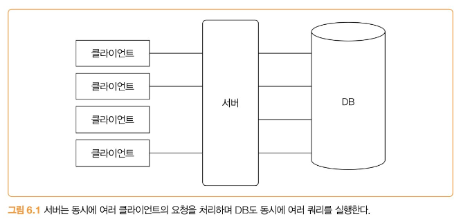

서버가 동시에 여러 클라이언트의 요청을 처리하는 방식은 크게 2가지가 있다.

1. **클라이언트 요청마다 스레드를 할당해서 처리**
    1. 동시 요청 개수만큼 스레드가 동시에 실행된다.
2. **비동기 IO(또는 논블로킹 IO)를 사용해서 처리**
   
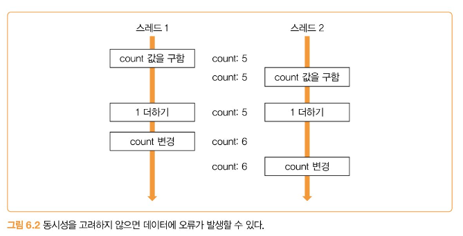

## 동시성 문제의 정의

- **경쟁 상태(Race Condition)**
    - 여러 스레드가 동시에 공유 자원에 접근할 때 접근 순서에 따라 결과가 달라지는 상황
- **동시성 문제**
    - 동시성을 고려하지 않고 코드를 짜면 데이터에 오류가 발생할 수 있다.

## 잘못된 데이터 공유로 인한 문제 예시

```java
public class PayService {
    private Long payId;

    public PayResp pay(PayRequest req){
        ...
        this.payId = getPayId(); // 단계 1
        saveTemp(this.payId, req); // 단계 2
        PayResp resp = sendPayData(this.payId, ...) // 단계 3
        applyResponse(resp);
        return resp;
    }

    private void applyResponse(PayResp resp) {
        PayData payData = createPayDataFromResp(resp); // 단계 4-1
        updatePayData(this.payId, payData); // 단계 4-2
    }
}
```
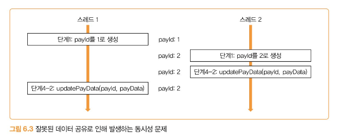


### 멤버 변수 공유 문제

다중 스레드 환경에서 PayService 객체가 동시에 사용되면 각 단계에서 생성한 payId 값들이 서로 다를 수 있다.

따라서 엉뚱한 데이터를 수정하게 된다.

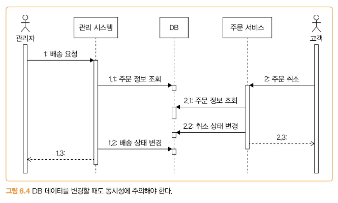

### 동시 수정 문제

관리자와 고객이 동시에 주문 정보를 변경할 때 발생할 수 있는 상황
- 관리자: 주문 상태를 배송으로 변경
- 고객: 주문을 취소

⇒ 고객은 주문을 취소했는데 시스템상으로는 배송이 시작되는 문제가 생김

## 프로세스 수준에서의 동시 접근 제어

### 잠금(lock)을 이용한 접근 제어

1. 잠금을 획득함
2. 공유 자원에 접근
    1. **임계 영역(Critical Section)**: 둘 이상의 스레드나 프로세스가 접근하면 안 되는 공유 자원에 접근하는 코드 영역을 말한다. 공유 자원의 예로는 메모리나 파일이 있다.
3. 잠금을 해제함

잠금은 한 번에 한 스레드만 획득할 수 있다. 여러 스레드가 동시에 잠금 획득을 시도하면 그중 하나만 획득하고 나머지 스레드는 잠금이 해제될 때까지 대기하게 된다. 잠금을 획득한 스레드는 공유 자원에 접근한 뒤 사용을 마치면 잠금을 해제한다. 잠금 해제되면 대기 중이던 스레드 중 하나가 잠금을 획득해 자원에 접근한다.

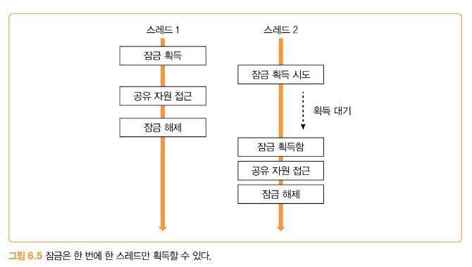


### synchronized와 ReentrantLock

`synchronized`를 사용하면 코드 블록이 끝나면 자동으로 잠금을 풀어주므로 `unlock()`같은 메서드를 호출할 필요가 없다.

반면에 `ReentrantLock`은 `synchronized`에는 없는 잠금 획득 대기 시간을 지정하는 기능을 제공한다.

`synchronized`는 자바 24 버전부터, `ReentrantLock`는 자바 21 버전부터 지원하고 있다.

어떤 걸 사용해도 무관하지만, 가능하면 한 가지 방식으로 통일하는 것이 좋다.

### Mutex

뮤텍스는 **mutual exclusion**의 줄임말인데 뮤텍스를 다른 말로 잠금이라고 한다. 프로그래밍 언어에 따라 뮤텍스를 사용하기도 하고 잠금을 사용하기도 한다.

### 동시 접근 제어를 위한 구성 요소

앞서 나온 `ReentrantLock`은 한 번에 1개 스레드만 잠금을 구할 수 있다. 즉, 한 번에 한 스레드만 공유 자원에 접근할 수 있다. 잠금 외에도 동시 접근을 제어하기 위한 구성요소로 세마포어와 읽기 쓰기 잠금이 있다.

#### 세마포어

- 동시에 실행할 수 있는 스레드 수를 제한한다.
- 예를 들어 외부 서비스에 대한 동시 요청을 최대 5개로 제한하고 싶을 때 세마포어를 사용할 수 있다.
- 허용 가능한 숫자를 이용해서 생성한다. 이는 자바에서는 퍼밋(permit), 고 언어에서는 weight라고 표현한다.
- 세마포어에는 이진 세마포어와 계수 세마포어가 있다. 이진 세마포어는 동시에 접근할 수 있는 스레드가 1개, 계수 세마포어는 지정한 수만큼 동시 접근이 가능하다.
- **순서**
    1. 세마포어에서 퍼밋 획득(허용 가능 숫자 1 감소)
    2. 코드 실행
    3. 세마포어에서 퍼밋 반환(허용 가능 숫자 1 증가)
- 세마포어에서 퍼밋을 구하는 연산은 **P 연산(wait 연산)**, 반환하는 연산은 **V 연산(signal 연산)** 이라고 한다.
```java
import java.util.concurrent.Semaphore;

public class MyClient {
    private Semaphore semaphore = new Semaphore(5);
    
    public String getData() {
        try {
            semaphore.acquire(); // 퍼밋 획득 시도
        } catch (InterruptedException e) {
            throw new RuntimeException(e);
        }
        try {
            String data = … // 외부 연동 코드
            return data;
        } finally {
            semaphore.release(); // 퍼밋 반환
        }
    }
}
```


#### 읽기 쓰기 잠금

읽기 작업과 쓰기 작업이 동일한 잠금을 사용해서 동시에 `put()`, `get()` 작업이 불가능하다. 오직 한 스레드만 `put()`을 하거나 `get()`을 할 수 있다. 잠금을 사용하면 데이터를 변경하지 않더라도 동시에 읽기가 안 된다. 한 번에 1개 스레드만 읽기 기능을 실행할 수 있기 때문이다. 하지만 한 번에 한 스레드만 읽기가 가능하므로 쓰기 빈도 대비 읽기 빈도가 높을 때에는 읽기 성능이 떨어지는 문제가 발생할 수 있다. 읽기 쓰기 잠금을 사용하면 이런 성능상 단점을 없애면서 동시성 문제를 없앤다.

- 쓰기 잠금은 한 번에 한 스레드만 구할 수 있다.
- 읽기 잠금은 한 번에 여러 스레드가 구할 수 있다.
- 한 스레드가 쓰기 잠금을 획득했다면 쓰기 잠금이 해제될 때까지 읽기 잠금을 구할 수 없다.
- 읽기 잠금을 획득한 모든 스레드가 읽기 잠금을 해제할 때까지 쓰기 잠금을 구할 수 없다.

### Atomic Type(원자적 타입)
```java
public class Increaser {
    private int count = 0;
    
    public void inc() {
        count = count + 1;
    }
}

// (ReentrantLock으로 동시성 문제를 해결한 버전)
public class Increaser {
    private Lock lock = new ReentrantLock();
    private int count = 0;
    
    public void inc() {
        lock.lock();
        try {
            count = count + 1;
        } finally {
            lock.unlock();
        }
    }
}
```

잠금을 사용하면 카운터 증가에 대한 동시성 문제를 간단하게 해결할 수 있지만, CPU 효율이 떨어지는 단점이 있다.
- 여러 스레드가 동시에 실행할 때 잠금을 확보한 스레드를 제외한 나머지 스레드는 대기하기 때문이다.

⇒ 이러한 문제를 해결하는 방법은 **Atomic Type**을 사용하는 것

- 예를 들어 자바의 `AtomicInteger`, `AtomicLong`, `AtomicBoolean`
- `AtomicInteger`는 내부적으로 **CAS 연산**을 사용한다.
    - **CAS 연산**: Compare and Swap의 약자로 그대로 비교 후에 교체하는 연산을 말한다.


### 동시성 지원 컬렉션

스레드에 안전하지 않은 컬렉션(HashMap, HashSet)을 여러 스레드가 공유하면 동시성 문제가 발생할 수 있다.

⇒ **동기화된 컬렉션**을 사용하는 것, 데이터를 변경하는 모든 연산에 잠금을 적용해서 한 번에 한 스레드만 접근할 수 있도록 제한하는 것이다. 동기화된 컬렉션 객체는 변경이나 조회와 관련된 메서드가 모두 동기화된 블록에서 실행되어 동시성 문제를 해결한다.

``` java
Map<String, String> map = new HashMap<>();
// 동기화된 컬렉션 객체 생성
Map<String, String> syncMap = Collections.synchronizedMap(map);
syncMap.put("key1", "value1"); // put 메서드는 내부적으로 synchronized로 처리됨
```

- **주의**: 자바 23 또는 이전 버전에서는 **가상 스레드 + `synchronized` 기반 동기화 컬렉션(`Collections.synchronizedMap()` 등)** 사용을 지원하지 않는다. 내부적으로 synchronized를 사용해 **가상 스레드가 플랫폼 스레드에 고정(pinning)**되며, 성능·확장성 문제가 발생할 수 있기 때문이다.
- 동시성 문제를 해결하는 또 다른 방법은 동시성 자체를 지원하는 컬렉션 타입을 사용하는 것이다. 예를 들어 HashMap 대신 `ConcurrentHashMap`을 사용할 수 있다.
    - 동시성 지원 컬렉션은 잠금 범위를 최소화한다.
    - 키의 해시 분포가 고르고 동시 수정이 많으면, 동기화된 맵을 사용하는 것보다 더 나은 성능을 제공한다.

## DB와 동시성

DB 트랜잭션은 여러 개의 조회나 쓰기를 논리적으로 하나의 연산으로 묶는다. 트랜잭션 안의 쿼리 중에 하나라도 실패하면 전체 트랜잭션을 롤백함으로써 데이터가 깨지는 것을 방지할 수 있다. 하지만 DB 트랜잭션만으로는 모든 동시성 문제를 해결할 수는 없다. 이런 문제를 해결하려면 DB에 맞는 잠금 기능을 활용해야 한다.

대부분의 DB는 명시적인 잠금 기법을 제공한다.

- **선점 잠금, 비관적 잠금**: 동일한 레코드에 대해 한 번에 하나의 트랜잭션만 접근할 수 있도록 제어할 수 있다.
    - 실패할 가능성이 높아서 비관적이라고 한다. 한 번에 1개 클라이언트만 접근할 수 있는 배타적 잠금을 사용
- **비선점 잠금, 낙관적 잠금**: 값을 비교해서 수정하는 방식으로, 쿼리 실행 자체는 막지 않으면서도 데이터가 잘못 변경되는 것을 막을 수 있다.
    - 낙관적은 반대로 성공할 가능성이 높아서 낙관적이다. 동시성 문제를 해결하기 위해 배타적 잠금까지는 사용하지 않는다.

### 선점(비관적) 잠금

데이터에 먼저 접근한 트랜잭션이 잠금을 획득하는 방식이다.

```sql
select * from 테이블 where 조건
for update
```

조건에 해당하는 레코드를 조회하면서 동시에 잠금을 획득한다. 한 트랜잭션이 특정 레코드에 대한 잠금을 획득한 경우, 잠금을 해제할 때까지 다른 트랜잭션은 동일 레코드에 대한 잠금을 획득하지 못하고 대기해야 한다. 레코드에 대한 잠금은 트랜잭션이 종료될 때 반환된다.

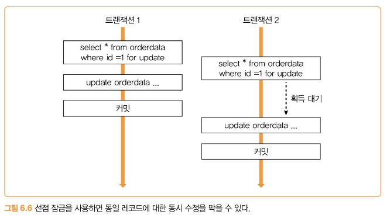
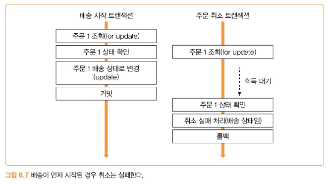
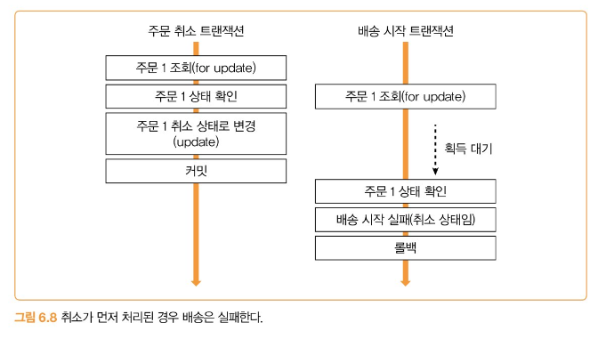


#### 분산 잠금

여러 프로세스가 동시에 동일한 자원에 접근하지 못하도록 막는 방법

앞에서 설명한 잠금과 큰 차이는 없지만, 분산 잠금은 여러 프로세스 간에 잠금 처리를 한다는 점에서 차이가 있다.

간단한 경우에는 DB에서 제공하는 선점 잠금을 사용하는 것이 좋지만, 트래픽이 많다면 레디스를 이용해 분산 잠금을 구현하는 것을 고려해봐라.

### 비선점(낙관적) 잠금

비선점 잠금은 명시적으로 잠금을 사용하지 않는다. 대신 데이터를 조회한 시점의 값과 수정하려는 시점의 값이 같은지 비교하는 방식으로 동시성 문제를 처리한다. 보통 비선점 잠금을 구현할 때는 정수 타입의 버전 칼럼을 사용한다.

1. SELECT 쿼리를 실행할 때 version 칼럼을 함께 조회한다.
    ```sql
    select ..., version from 테이블 where id = 아이디
    ```
2. 로직을 수행한다.
3. UPDATE 쿼리를 실행할 때 version 칼럼을 1 증가시킨다. 이때 version 칼럼 값이 1에서 조회한 값과 같은지 비교하는 조건을 where 절에 추가한다.
    ```sql
    UPDATE 테이블 SET ..., version = version + 1
    WHERE id = 아이디 AND version = [1에서 조회한 version 값]
    ```
4. UPDATE 결과로 변경된 행 개수가 0이면, 이미 다른 트랜잭션이 version 값을 증가시킨 것이므로 데이터 변경에 실패한 것이다. 이 경우 트랜잭션을 롤백한다.
5. UPDATE 결과로 변경된 행 개수가 0보다 크면, 다른 트랜잭션보다 먼저 데이터 변경에 성공한 것이므로 트랜잭션을 커밋한다.

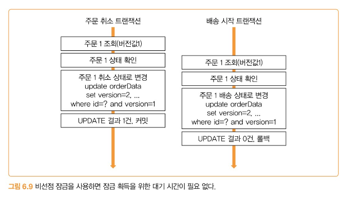


선점 잠금과 비교해보면 비선점 잠금은 잠금을 구하기 위한 대기 과정이 없기 때문에 실패할 경우 사용자에게 더 빠르게 결과를 응답할 수 있다는 장점이 있다.

#### 외부 연동과 잠금
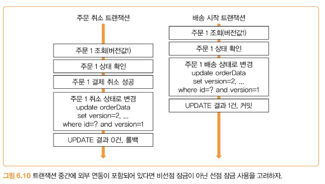

트랜잭션 범위 내에서 외부 시스템과 연동해야 한다면, 비선점 잠금보다는 선점 잠금을 고려하는 것이 좋다.

비선점 잠금을 사용하고 싶다면 트랜잭션 아웃박스 패턴을 적용해서 외부 연동을 처리하는 방법도 있다.

### 증분 쿼리
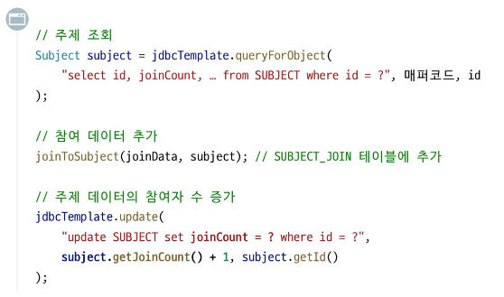

참여자 수를 증가시키기 위해 `joinCount` 값을 조회하고, 그 값에 1을 더해서 값을 갱신한다.

논리적으로 문제가 없어 보이지만, 동시에 두 명이 이 코드를 실행하면 `joinCount`는 2가 아니라 1만 증가하는 문제가 발생할 수 있다.

이 문제를 해결하기 위해 선점 잠금을 사용하면 잠금 대기 시간만큼 응답 시간이 길어진다.

비선점 잠금을 사용하면 대기 시간은 없지만 변경 실패 에러가 자주 발생할 수 있다.

⇒ **증분 쿼리**를 사용

```sql
update SUBJECT set joinCount = joinCount + 1 where id = ?
```

DB는 `joinCount` 연산을 원자적 연산으로 처리한다. (**원자적 연산**: 실행이 시작되면 중간에 다른 작업에 방해받지 않고 끝까지 실행되는 것을 보장하는 연산)

동일 데이터에 대한 원자적 연산이 동시에 실행될 경우 이를 순차적으로 실행한다. 따라서 데이터 누락 문제가 발생할 수 있다.

중요한 점은 증분 쿼리는 DB에 따라 원자적 연산이 아닐수도 있다. 따라서 증분 쿼리를 사용할 때는 사용하는 DB에서 원자적으로 처리되는지 반드시 검증해야 한다.

## 잠금 사용 시 주의 사항

### 잠금 해제하기

잠금을 획득한 뒤에는 반드시 잠금을 해제해야 한다. 그렇지 않으면 잠금을 시도하는 스레드가 무한정 대기하게 된다.

세마포어도 마찬가지로 퍼밋을 획득했다면 반드시 퍼밋을 반환해야 한다.

잠금을 사용할 때는 습관적으로 `finally` 블록에서 잠금을 해제하는 코드를 작성하는 습관을 들여놓는 것이 좋다.

### 대기 시간 지정하기
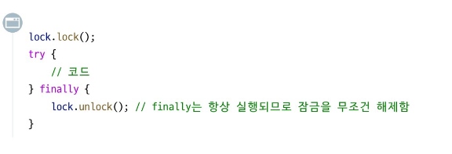

잠금 획득을 시도하는 코드는 잠금을 구할 수 있을 때까지 계속 대기하는데, 동시 접근이 많아지면 대기 시간이 길어지는 문제가 발생할 수 있다.

5초 동안 잠금 획득을 시도한다.

사용자가 결과를 모른 채 긴 시간 동안 응답을 기다리는 것보다는 빠르게 실패 응답을 주는 것이 좋다.

### 교착 상태(deadlock) 피하기

한 자원에서 다른 자원으로 용량을 전송하는 기능을 구현한다고 가정 → 두 자원에 대한 잠금이 필요

**교착 상태**: 2개 이상의 스레드가 서로가 획득한 잠금을 대기하면서 무한히 기다리는 상황

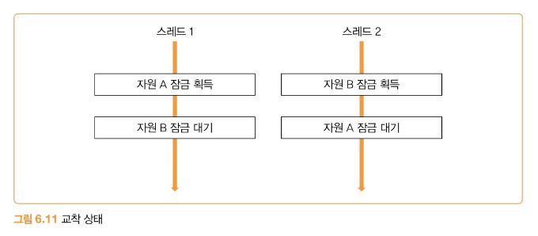

스레드 1은 자원 A에 대한 잠금을 획득, 스레드 2는 자원 B에 대한 잠금을 획득

이어서 스레드 2는 자원 A에 대한 잠금 획득을 시도하지만 자원 A에 대한 잠금을 획득했으므로 스레드 2는 스레드 1이 자원 A의 잠금을 해제할 때까지 대기

하지만 스레드 1은 자원 B에 대한 잠금 획득을 시도하기 때문에 자원 A에 대한 잠금을 해제할 수 없다.

⇒ 스레드 1과 스레드 2가 서로 상대방이 획득한 잠금을 무한히 대기하는 상황이 벌어진다.

#### 해결방법

1. **잠금 대기 시간 제한**: 잠금 대기 시간을 5초로 제한하면 교착 상태가 발생하더라도 5초 뒤에 잠금 획득에 실패하면서 교착 상태가 풀리게 된다.
2. **지정한 순서대로 잠금 획득하기**


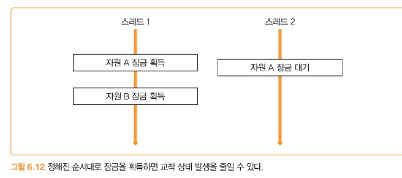

#### 라이브락 VS 교착 상태

- **라이브락**: 활동을 하는 것 같지만 아무것도 하지 않는 상태

- **교착 상태**: 아무것도 하지 않고 무한 대기

#### 기아 상태(starvation)

프로세스나 스레드가 자원을 할당받지 못해 실행되지 못하는 상태 (우선순위에 밀려)

→ 실행이 안되는 작업의 우선순위를 높이거나, 여러 프로세스, 스레드가 공유하는 자원을 독점하는 시간에 제한을 두어 가능한 작업을 실행할 수 있도록 해야 한다.

## 단일 스레드로 처리하기

동시성 문제가 발생하는 주된 이유는 여러 스레드가 동시에 동일 자원에 접근하기 때문

이를 방지하기 위해 잠금과 같은 해결책을 사용하지만 잠금을 잘못 사용하면 교착 상태같은 상황이 발생할 수 있어서 주의 해야함

이러한 복잡성을 없게 하면서 동시성 문제를 피하는 방법이 있다.

**한 스레드만 자원에 접근하는 단일 스레드로 처리하기**

상태 관리 스레드에서만 데이터를 조작

데이터 변경이나 접근이 필요한 스레드는 작업 큐에 필요한 작업을 추가할 뿐 직접 상태에 접근하지 못한다.

한 스레드만 접근하기 때문에 잠금과 같은 수단이 필요 없어 코드가 단순해진다.

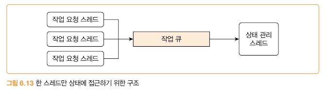

두 스레드가 데이터 공유가 필요하면 콜백이나 큐와 같은 수단을 사용해서 데이터 복제본을 공유한다. 복제본 대신 불변 값을 공유하기도 한다.

## 정리

### 프로세스 수준 제어 VS DB 수준 제어

#### 기준 1: 보호하려는 자원이 어디에 있는가?

- **프로세스 수준 제어**
    - **애플리케이션 메모리**에 있는 데이터를 보호할 때 사용
    - 예를 들어, 여러 스레드가 하나의 객체 필드 값이나, static 변수, 캐시 데이터 등을 동시에 수정하려 할 때 데이터가 깨지는 것을 막기 위함
- **DB 수준 제어**
    - **데이터베이스**에 저장된 데이터를 보호할 때 사용
    - 예를 들어, 여러 사용자가 동시에 같은 상품의 재고를 줄이거나, 같은 게시물을 수정하는 상황을 막기 위함

#### 기준 2: 서버가 여러 대로 확장될 가능성이 있는가?

- **프로세스 수준 제어**
    - **서버가 한 대일 때만 유효하**다. 서버가 여러 대가 되면 A 서버의 메모리 잠금(Lock)은 B 서버에 아무런 영향을 주지 못해 동시성 제어에 실패.
- **DB 수준 제어**
    - **서버가 여러 대로 확장된 환경에서 필수적이**다. 데이터베이스가 중앙에서 모든 서버의 요청을 조율하며 데이터의 일관성을 보장해준다.

### 프로세스 수준 제어 (단일 서버, 메모리 공유)

- **`synchronized`, `ReentrantLock` (기본 잠금)**
    - 한 번에 하나의 스레드만 코드 영역에 접근하도록 막는 방식.
    - **언제?** → **임계 구역(Critical Section)** 보호, 여러 스레드가 **공유 객체/메모리** 수정 시
    - 핵심 키워드: 임계 영역, Mutex, synchronized, ReentrantLock
- **세마포어 (Semaphore)**
    - 정해진 숫자만큼의 스레드만 자원에 동시 접근하도록 허용하는 방식.
    - **언제?** → **동시 실행 스레드 수 제한**, 외부 API 호출 개수 제어, 커넥션 풀처럼 **자원 개수 관리** 시
    - 핵심 키워드: 퍼밋, P 연산, V 연산
- **읽기-쓰기 잠금 (Read-Write Lock)**
    - 읽기는 여러 스레드가 동시에, 쓰기는 하나의 스레드만 하도록 분리하여 제어하는 방식.
    - **언제?** → **읽기 작업이 쓰기보다 압도적으로 많을 때** (읽기 성능 향상 목적)
- **원자적 타입 (Atomic Type)**
    - 잠금을 사용하지 않고 단일 변수에 대한 연산을 쪼갤 수 없는 하나의 단위로 처리하는 방식.
    - **언제?** → **단순 카운터, 플래그 값** 증감/변경 시 (일반 잠금보다 가볍고 빠름)
    - 핵심 키워드: 자바의 AtomicInteger, AtomicLong, AtomicBoolean, CAS 연산 (Compare and Swap)
- **동시성 지원 컬렉션 (Concurrent Collection)**
    - 여러 스레드가 안전하게 접근할 수 있도록 내부적으로 동시성 제어가 구현된 자료구조.
    - **언제?** → 여러 스레드가 공유 자료구조(Map, List 등)를 안전하게 사용해야 할 때
    - ConcurrentHashMap, 가상 스레드

### DB 수준 제어 (여러 서버, 데이터 공유)

- **선점/비관적 잠금 (`FOR UPDATE`)**
    - 데이터 충돌을 예상하고, 수정할 데이터를 읽는 시점부터 잠가 다른 접근을 막는 방식.
    - **언제?** → **충돌이 자주 예상될 때**, **금액, 재고**처럼 데이터 정합성이 매우 중요할 때
- **비선점/낙관적 잠금 (버전 관리)**
    - 데이터 충돌이 드물 것으로 보고, 수정 시점에 버전(version)이 변경되었는지 확인하여 제어하는 방식.
    - **언제?** → **충돌이 드물게 예상될 때**, **조회는 많고 수정은 적을 때** (성능, 빠른 응답 우선)
- **증분 쿼리 (`count = count + 1`)**
    - DB의 원자적 연산을 이용해 카운터 같은 숫자 값을 데이터 충돌 없이 갱신하는 쿼리 방식.
    - **언제?** → **조회수, 좋아요 수** 등 단순 숫자 값을 증감시킬 때
- **분산 잠금 (Redis 등)**
    - 여러 서버에 걸친 분산 환경에서 공유 자원에 대한 접근을 제어하기 위해 별도의 시스템을 사용하는 방식.
    - **언제?** → DB 잠금 부하가 크거나, **DB 외의 자원**에 대한 분산 환경 잠금이 필요할 때

### 기타 아키텍처

- **단일 스레드 처리 (작업 큐 활용)**
    - 특정 자원에 대한 모든 작업을 하나의 스레드에서만 순차적으로 처리하여 동시성 문제를 원천적으로 회피하는 방식.
    - **언제?** → 복잡한 잠금 로직을 피하고 싶을 때, **순서 보장이 중요**한 작업을 처리할 때
