# 외부 연동 문제

마이크로서비스를 도입하는 기업이 늘면서 내부 서비스 간 연동도 복잡해지고 있다. 
⇒ 신경 써야 할 품질 문제도 늘고 있다. 
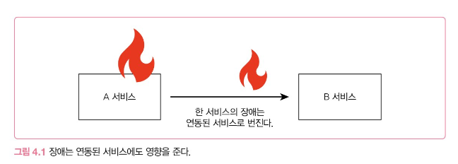

연동 서비스 문제를 완전히 차단하기는 어렵지만, 영향을 줄일 수 있는 몇가지 방법을 살펴보자.

## 타임아웃과 재시도

타임아웃을 설정하지 않으면, 연동 서비스에 장애가 발생했을 때 전체 서비스의 품질이 급격히 나빠질 수 있다.
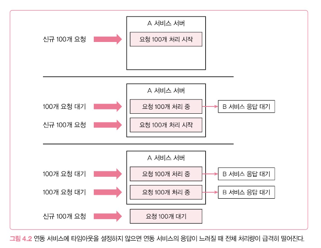
A서비스는 동시에 200개의 요청 처리 가능

B서비스는 성능 문제가 생겨 응답 시간이 60초를 넘기기 시작

⇒ 처리량이 급격히 떨어짐 : 연동 서비스 타임아웃을 설정하지 않았기 때문

⇒ 타임아웃을 5초로 설정해보자. 5초가 지난 뒤 시간 초과 에러를 응답하기 때문에 연동 서비스 문제가 다른 기능에 주는 영향을 줄일 수 있다. (사용자 입장에서 무한 대기화면보다는 에러 화면이라도 보는것이 낫다.)

### 연결 타임아웃, 읽기 타임아웃
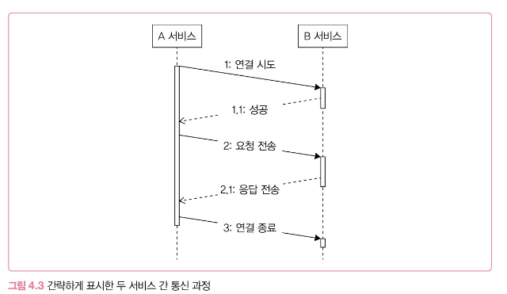
- **연결 타임아웃**: 네트워크 연결을 시도하고 대기하는 연결 대기 시간 (보통 3-5초로 설정)
- **읽기 타임아웃**: 연결이 되고 요청을 전송 후 응답을 기다리기 까지의 응답 대기 시간 (보통 5-30초)
    - 읽기 타임아웃이 너무 길다고 느껴질 수 있지만 정상 처리임에도 타임아웃 에러가 발생하는 경우가 생김
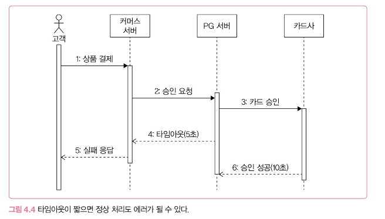
## 재시도
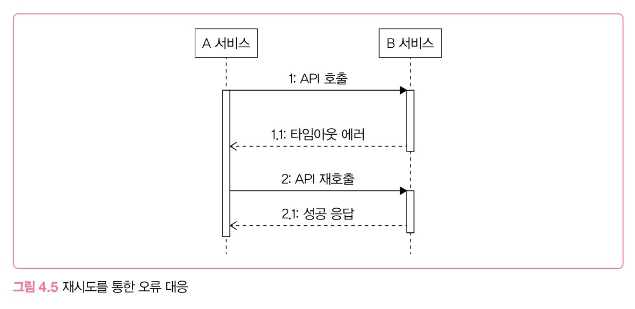

일시적으로 응답이 느려지는 경우에는 재시도를 통해 연동 실패를 성공으로 바꿀 수 있다.

### 재시도 가능 조건
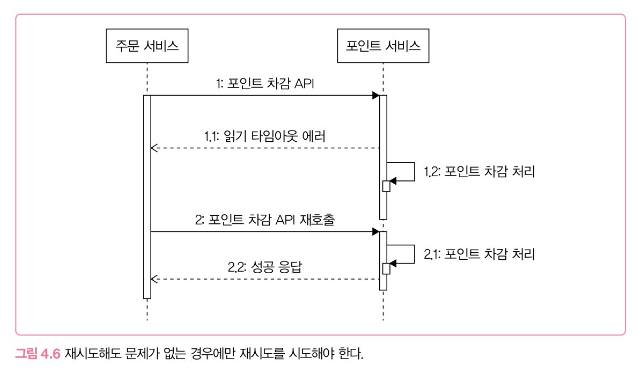

항상 재시도를 할 수 있는 것이 아니기 때문에 다시 호출해도 되는 조건인지 확인해야 한다.

1. 단순 조회 기능
2. 연결 타임아웃
3. 멱등성을 가진 변경 기능 

### 재시도 횟수와 간격

- **재시도 횟수**: 1-2번 정도의 재시도가 적당하다. 2번 재시도 후 실패는 다른 근본적인 문제일 가능성이 높다
- **재시도 간격**: 바로 재시도를 하면 같은 문제가 발생할 가능성이 높기 때문에 텀을 두고 재시도하면 일시적인 네트워크 문제가 해소되면서 재시도가 성공할 가능성이 높아진다.

### 재시도 폭풍(retry strom) 안티패턴

- 재시도는 성공 가능성은 높이지만, 연동 서비스에는 더 큰 부하를 준다.
- 연동 서비스의 성능이 느려진 상태에서 새로운 요청까지 더해지면 연동 서비스의 성능은 더 나빠진다. 따라서 재시도를 검토할 때는 연동 서비스의 성능 상황도 함께 고려해야 한다.

## 동시 요청 제한

- 연동 서비스가 한번에 처리할 수 있는 동시 요청 수: 100개
- 처리량을 초과하면 응답 시간이 느려지기 시작한다.

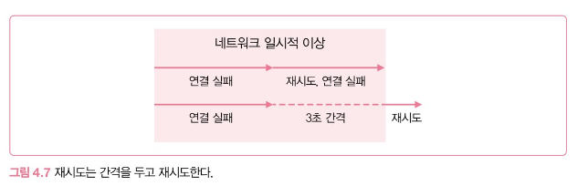

⇒ 연동 서비스에 요청을 일정 수준 이상으로 보내지 않아야 한다.
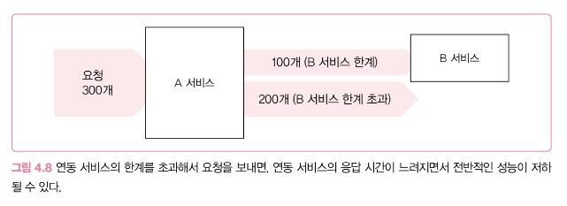

보내지 않은 요청은 바로 에러를 응답 (503 Service Unavailable)

**벌크헤드**: 각 구성 요소를 격리함으로써 한 구성 요소의 장애가 다른 구성 요소에 영향을 주지 않도록 하는 패턴

## 서킷 브레이커

**빠른 실패**: 서킷 브레이커는 과도한 오류가 발생하면 연동을 중지시키고 바로 에러를 응답한다. 
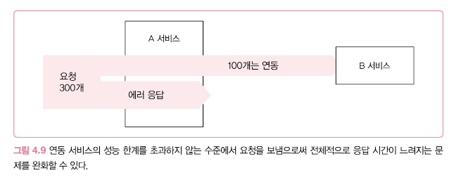

### 서킷 브레이커 동작 방식

1. **닫힘 상태**로 시작: 모든 요청을 연동 서비스에 전달
    1. 오류가 발생하면 지정한 임계치를 초과했는지 확인
    2. 임계치 초과 → 열림 상태
    3. 시간 기준 오류 발생 비율, 개수 기준 오류 발생 비율
2. **열림 상태** → 바로 에러 응답 리턴 
    1. 지정된 시간동안 열림 유지 → 반 열림 상태로 전환 → 연동 성공 → 닫힘 상태로 복귀 

## 외부 연동과 DB 연동

DB 연동과 외부 연동을 함께 실행할 때는 오류 발생 시 DB 트랜잭션을 어떻게 처리할지 알맞게 판단해야 함

### 외부 연동에 실패했을 때 트랜잭션을 롤백
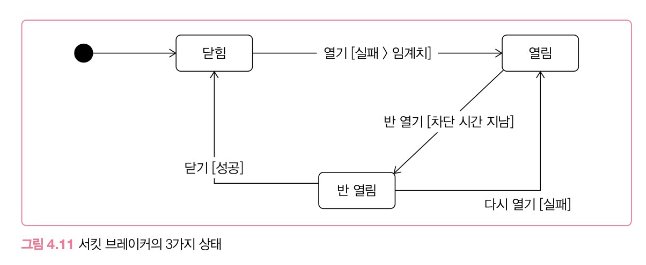

- 위의 사진은 롤백했는데 외부 서비스는 성공했다.

  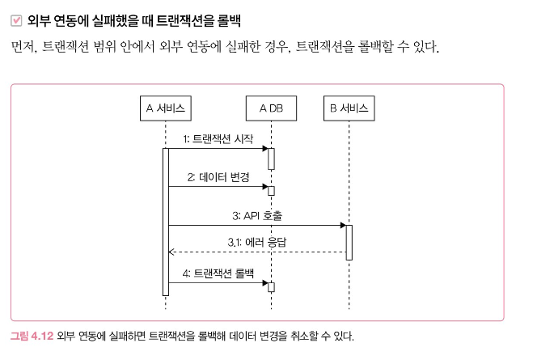
  
    1. 일정 주기로 두 시스템의 데이터가 일치하는지 확인하고 보정
    2. 성공 확인 API 호출 (연동 서비스에서 제공해야만 사용 가능)

### 외부 연동은 성공했지만 DB연동에 실패해 트랜잭션을 롤백

- 취소 API가 없거나 취소에 실패할 수도 있기 때문에 데이터 일관성이 중요한 서비스라면 일정 주기로 데이터가 맞는지 비교하는 프로세스를 갖추는 것이 좋다.

### 외부 연동이 느려질 때 DB 커넥션 풀 문제

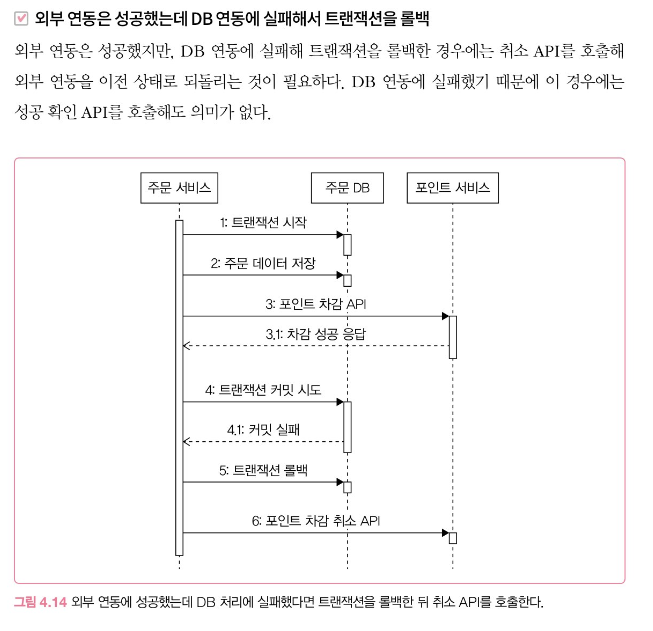

DB 연동과 무관하게 외부 연동을 실행할 수 있다면 DB 커넥션을 사용하기 전이나 후에 외부 연동을 시도하는 방안도 고려해볼 수 있다.

단, 이 방식은 실패하면 롤백이 불가능하기 대문에 실패 후 후처리를 반드시 고민해야한다.

후처리 방법으로는 트랜잭션으로 반영된 데이터를 되돌리는 보상 트랜잭션을 사용하는 방법 또는 기능 특성에 따라 데이터를 후보정하는 방법 등이 있다.

## HTTP 커넥션 풀
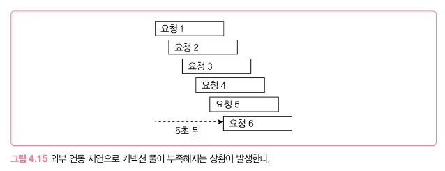

HTTP 연결도 커넥션 풀을 사용하면 연결 시간을 줄일 수 있어 응답 속도에 향상에 도움이 된다.

### 고려사항

1. **HTTP 커넥션 풀의 크기**
    1. 연동 서비스의 성능에 따라 결정해야 한다.
2. **풀에서 HTTP 커넥션을 가져올 때까지 대기하는 시간**
    1. 대기 시간이 길어지면 전체 응답 시간도 함께 늘어나므로 대기 시간은 수 초 이내의 짧은 시간이 좋다. (1-5초 추천)
3. **HTTP 커넥션을 유지할 시간(keep alive)**
    1. 커넥션은 무한정 유지되지 않는다. 끊어진 커넥션을 사용하면 에러가 발생하므로 연동 서비스에 맞춰 유지 시간을 적절히 설정해야 한다. 
    2. Keep-Alive 헤더로 연결 유지 시간을 지정하기 때문에 이 값보다 커넥션을 오래 유지하면 안된다. 

## 연동 서비스 이중화
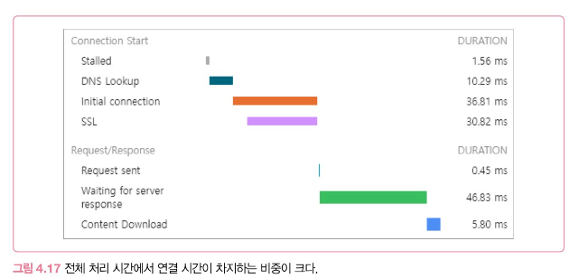

대량 트래픽을 처리해야 한다면 연동 서비스의 이중화를 고려해야한다. 물론 유지비용도 증가한다. 다음 2가지를 따져봐라.

1. 해당 기능이 서비스의 핵심인지 여부
2. 이중화 비용이 감당 가능한 수준인지
